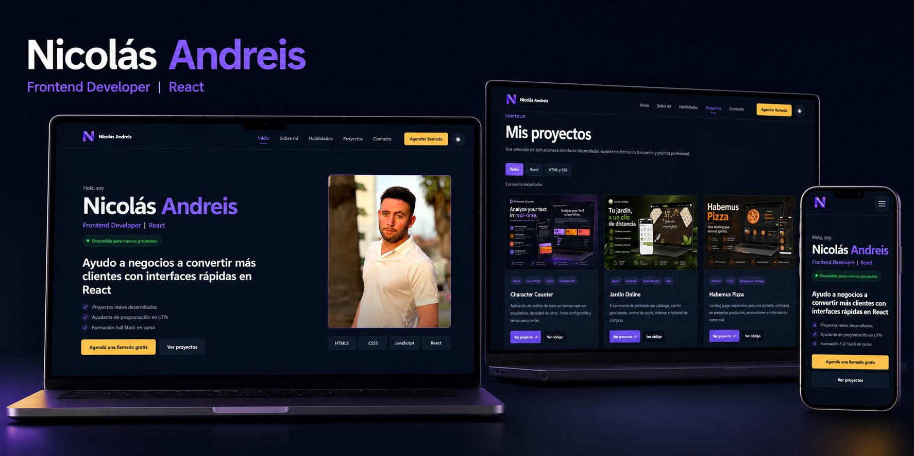
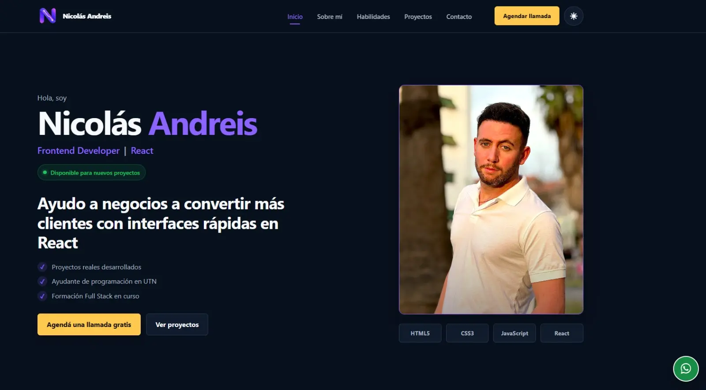
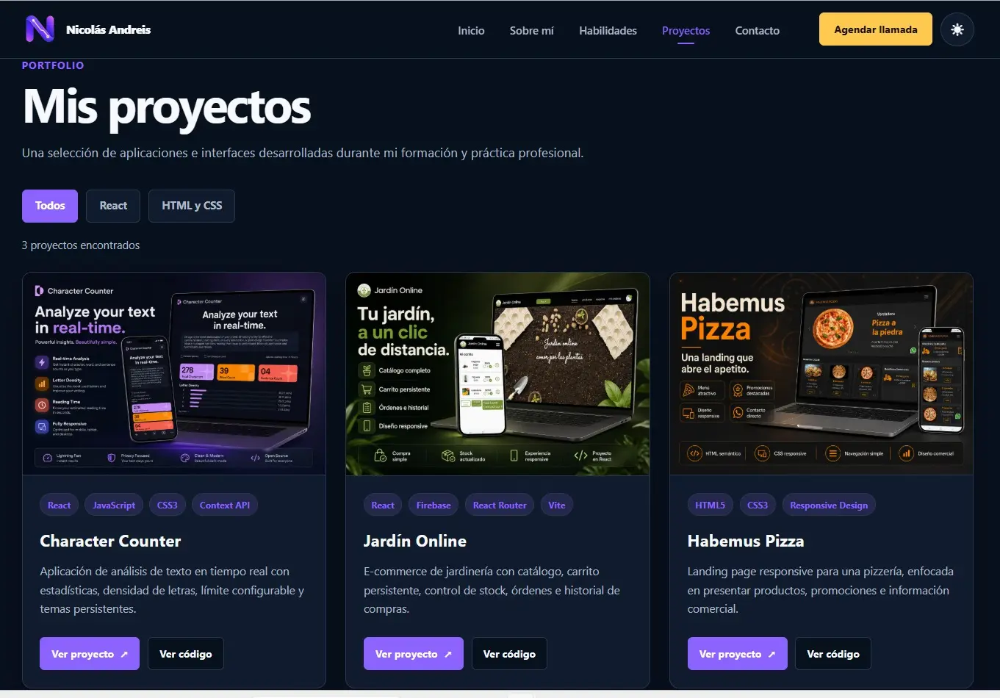
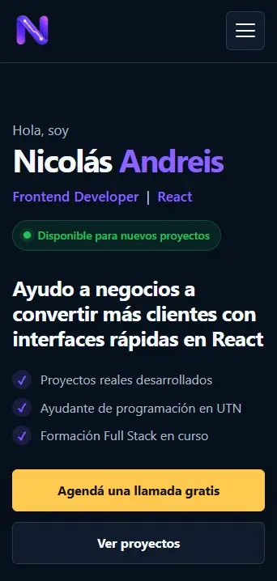

# Portfolio de Nicolás Andreis



Portfolio personal desarrollado con React como trabajo práctico final de Frontend.

La aplicación presenta mi perfil profesional, habilidades técnicas, metodología de trabajo y proyectos realizados. También cuenta con diferentes medios de contacto y una interfaz responsive con temas claro y oscuro.

## Demo

- **Sitio publicado:** [nicolas-andreis.vercel.app](https://nicolas-andreis.vercel.app/)
- **Repositorio:** [github.com/Nicolas-Andreis/portfolio-andreis](https://github.com/Nicolas-Andreis/portfolio-andreis)

## Funcionalidades

- Navegación entre distintas páginas con React Router.
- Página principal con presentación, información profesional y habilidades.
- Galería de proyectos mediante componentes reutilizables.
- Filtros de proyectos reflejados en los parámetros de la URL.
- Formulario de contacto controlado con validaciones.
- Tema claro y oscuro persistente.
- Menú responsive para dispositivos móviles.
- Navegación hacia secciones internas.
- Animaciones de aparición durante el scroll.
- Botón flotante de contacto mediante WhatsApp.
- Preferencias guardadas en `localStorage`.
- Diseño accesible y responsive desde 320 px hasta 2000 px.
- Respeto por la preferencia `prefers-reduced-motion`.

## Tecnologías utilizadas

- React
- JavaScript
- React Router DOM
- Context API
- CSS3
- Vite
- Local Storage
- Intersection Observer
- Git y GitHub
- Vercel

## Capturas

### Página principal



### Galería de proyectos



### Diseño responsive

<p align="center">
  
</p>

## Rutas

| Ruta | Descripción |
| --- | --- |
| `/` | Página principal |
| `/projects` | Galería completa de proyectos |
| `/projects?category=react` | Proyectos filtrados por React |
| `/projects?category=html-css` | Proyectos filtrados por HTML y CSS |
| `/contact` | Información y formulario de contacto |

## Requisitos del trabajo cumplidos

- Aplicación desarrollada en React.
- Uso de componentes reutilizables.
- Manejo de estados.
- Uso de Context API.
- Enrutamiento mediante `react-router-dom`.
- Tres páginas dentro del flujo de navegación.
- Parámetros de búsqueda mediante `useSearchParams`.
- Formulario controlado con validaciones.
- Diseño responsive desde 320 px hasta 2000 px.
- Temas claro y oscuro.
- Estilos accesibles y navegación mediante teclado.
- Código organizado siguiendo los principios DRY, KISS y YAGNI.
- Código publicado en GitHub.
- Despliegue de producción en Vercel.
- Configuración de rutas SPA para permitir el acceso directo y la recarga.

## Proyectos presentados

### Character Counter

Aplicación de análisis de texto en tiempo real desarrollada con React. Calcula caracteres, palabras, oraciones, tiempo estimado de lectura y densidad de letras.

- [Ver proyecto](https://character-counter-andreis.vercel.app/)
- [Ver repositorio](https://github.com/Nicolas-Andreis/character-counter-react)

### Jardín Online

E-commerce de jardinería desarrollado con React y Firebase. Incluye catálogo, carrito persistente, control de stock, órdenes e historial de compras.

- [Ver proyecto](https://nicolas-andreis.github.io/Jardin-Online/)
- [Ver repositorio](https://github.com/Nicolas-Andreis/Jardin-Online)

### Habemus Pizza

Landing page responsive desarrollada con HTML y CSS para presentar productos, promociones e información comercial de una pizzería.

- [Ver proyecto](https://nicolas-andreis.github.io/habemus_pizza/)
- [Ver repositorio](https://github.com/Nicolas-Andreis/habemus_pizza)

## Instalación

Requisitos:

- Node.js
- npm

Para ejecutar el proyecto localmente:

```bash
git clone https://github.com/Nicolas-Andreis/portfolio-andreis.git
cd portfolio-andreis
npm install
npm run dev
```

## Scripts disponibles

```bash
npm run dev
npm run lint
npm run build
npm run preview
```

## Estructura principal

```text
src/
├── assets/
├── components/
├── context/
├── data/
├── pages/
├── styles/
├── App.jsx
└── main.jsx
```

## Decisiones técnicas

Los datos de proyectos y habilidades se encuentran separados de los componentes para evitar repeticiones y facilitar su mantenimiento.

El tema claro y oscuro se administra mediante Context API y se conserva en `localStorage`.

Los filtros utilizan `useSearchParams`, permitiendo compartir o recargar una URL con una categoría activa.

Las animaciones se implementaron con `IntersectionObserver`, sin agregar dependencias innecesarias, y respetan la preferencia de movimiento reducido del sistema.

Las imágenes promocionales se convirtieron a WebP para reducir su peso y mejorar la carga en dispositivos móviles.

Se añadió una configuración de rewrite para que las rutas administradas por React Router funcionen al abrirlas o recargarlas directamente en Vercel.

## Formulario de contacto

El formulario demuestra:

- Campos controlados con estado.
- Validación de datos.
- Mensajes de error accesibles.
- Confirmación visual.

Actualmente funciona como demostración y no envía correos reales. El contacto directo está disponible mediante WhatsApp y correo electrónico.

## Accesibilidad

- Contraste diferenciado para temas claro y oscuro.
- Indicadores de foco visibles.
- Etiquetas asociadas a los campos del formulario.
- Mensajes de error vinculados mediante atributos ARIA.
- Navegación accesible mediante teclado.
- Menú móvil con `aria-expanded` y `aria-controls`.
- Animaciones desactivadas cuando el sistema solicita reducir el movimiento.
- Idioma principal del documento configurado en español.

## Dificultades encontradas

- Adaptar el diseño entre 320 px y pantallas de hasta 2000 px.
- Sincronizar la navegación interna con los hashes de la URL.
- Conservar el tema seleccionado entre sesiones.
- Implementar filtros mediante parámetros de búsqueda.
- Crear animaciones accesibles sin dependencias adicionales.
- Optimizar imágenes sin perder calidad visual.
- Mantener componentes reutilizables y estilos organizados.
- Configurar el fallback de rutas para el despliegue de una SPA.

## Autor

**Nicolás Andreis**

- [GitHub](https://github.com/Nicolas-Andreis)
- [LinkedIn](https://www.linkedin.com/in/nicol%C3%A1s-andreis/)
- Correo: `jnandreis@outlook.com`